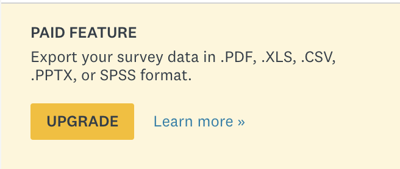

# FreeSurveyMonkey

## Why this exists

So you used survey monkey to collect some data. But you want to get your results in a spreadsheet.



You think it'd be like 5 dollar, but...


So I decided to write a selenium-based webdriver program that extracts participant data into a spreadsheet.

## Installation

```shell
python3 -m venv env
source env/bin/activate
pip3 install -r requirements.txt
```

Create a file named `secrets.py` in the root repository, and put in

```python
secrets = {"username": "YOUR USERNAME", "password": "YOUR PASSWORD"}
```
